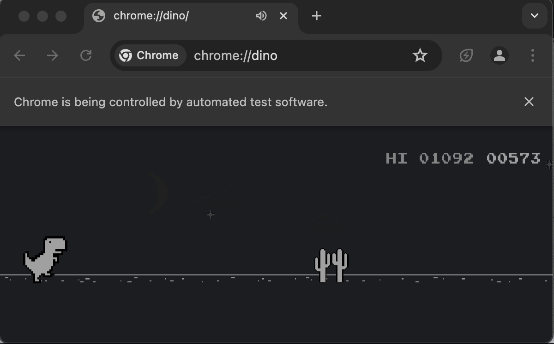

<div align = 'center'>

# smart_dino
<p></p>

This is the pytorch implementation of the DQN algorithm which is used to solve the chrome's dino game.
Chrome's dino environment is captured through [selenium](https://selenium-python.readthedocs.io/).

</div>

## files/folders structure

```
.
├── .gitignore
├── DQN.py (Implementation of DeepQLearning class and createNetwork class)
├── README.md
├── dino_env.yml (requirements file for creating the conda env)
├── env.py (Class implementation of WebDino, which containes all the necessary functions and attributes for creating the environment)
├── main.py (Here all the classes come together and the model is sent into training)
├── misc
│   └── dino_model.gif
├── results
│   ├── DQ_6.png
├── models (Contains the pretrained model)
│   ├── ckpt_1800.pt 
└── vis.py
```

## overview architecture
<p align="center">

</p>

## dependencies
- `pytorch`
- `selenium` for interacting with the browser.
- `pandas` for creating and storing rewards graphs.
- `pillow` for the taking the screenshots on a specified location on display.
- `opencv` for image processing before feeding to model.

## rewards/episodes
<p align="center">

</p>

## install
> [!Important]
> To install conda or miniconda follow this [link](https://conda.io/projects/conda/en/latest/user-guide/install/index.html)

If you have conda already installed, then to create the separate env which will contain all the necessary libraries run the below commands.
```
git clone https://github.com/davnish/smart_dino # cloning the repo
cd smart_dino # Moving inside the repo
conda env create --name dino --file=dino_env.yml # Installing the libraries
```
Then just activate the environment by, 
```
conda activate dino
```

